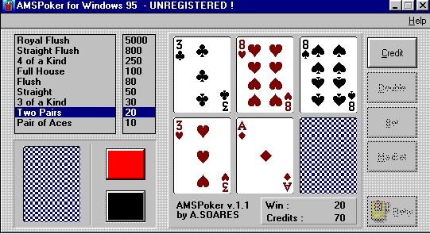

# AMSPoker v1

## Description

Poker Game written in 1996 with Borland C++/OWL.

## Dependencies

* [Borland C++](https://en.wikipedia.org/wiki/Borland_C%2B%2B)
* [Object Windows Library](https://en.wikipedia.org/wiki/Object_Windows_Library)

## Build and run

Created with Borland C++ 4.52

## Author

* [Antonio Soares](https://github.com/ccie18473)

## License

This project is licensed under the [MIT] License - see the LICENSE.md file for details

